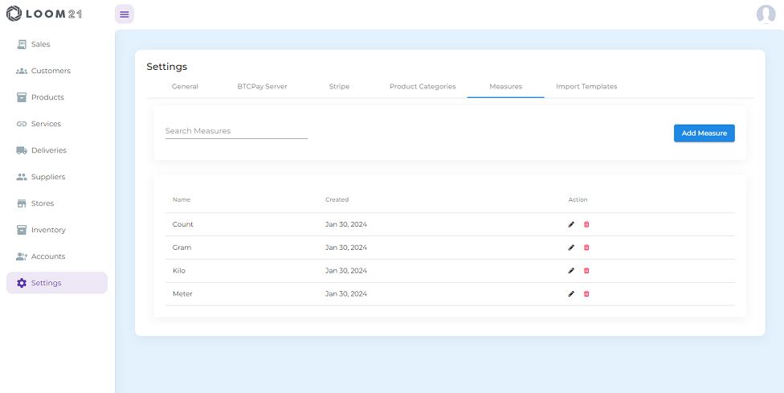
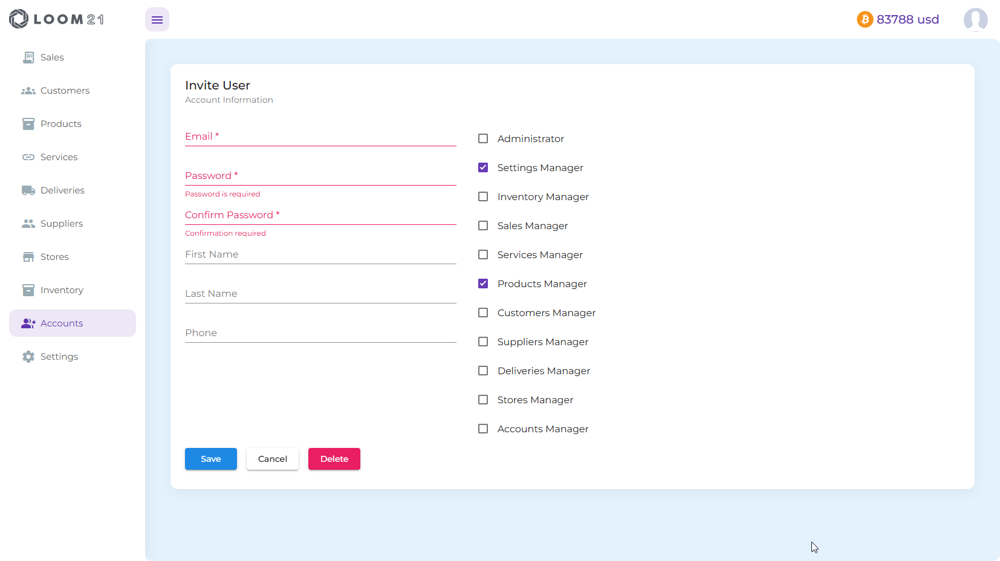

# Documentation Overview

## Settings
- **General settings**  

On this page, you can change your default store, language, currency, VAT settings, show/hide bitcoin prices, or switch between light and dark mode.
- **BTCPay Server**  

  To accept bitcoin payments, you need to set your BTCPay Server URL and API Key.
- **Stripe** 

  To accept fiat payments through Stripe, you need to set Stripe Publishable and Secret keys.
- **Product Categories**

  Categorize your products for better organization, making them easier to find.
- **Measures**
  
  Set product/service measures.
- **Import Templates**

  If you already have a list of products/services, customers, and suppliers, you can import them directly into the system.
  

## Accounts

- You can invite as many users to your organization as needed.

## Inventory
- View and update your product inventory per store.

## Stores
- Add or edit stores.

## Suppliers
- View all your vendors, or add and edit new ones.
## Products
## Services
## Deliveries
## Customers
## Sales
