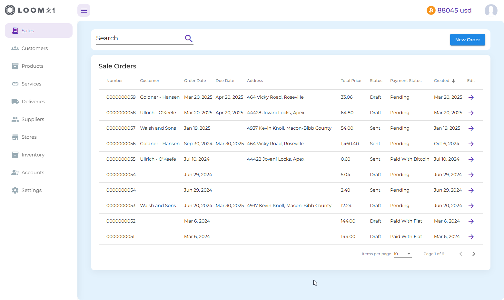
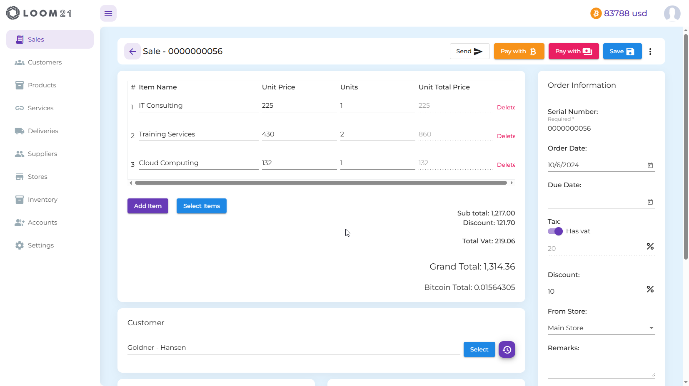

# Documentation Overview

## Settings
- **General settings**  

On this page, you can change your default store, language, currency, VAT settings, show/hide bitcoin prices, or switch between light and dark mode.
  
- **BTCPay Server**  

  To accept bitcoin payments, you need to set your BTCPay Server URL and API Key.
    
- **Stripe** 

  To accept fiat payments through Stripe, you need to set Stripe Publishable and Secret keys.
    
- **Product Categories**

  Categorize your products for better organization, making them easier to find.
   
 - **Measures**
  
  Set product/service measures.
  
- **Import Templates**

  If you already have a list of products/services, customers, and suppliers, you can import them directly into the system.
  

## Accounts

You can invite as many users to your organization as needed.

## Inventory
View and update your product inventory per store.

## Stores
- Add or edit stores.

## Suppliers
- View all your vendors, or add and edit new ones.
## Products
## Services
## Deliveries
## Customers
## Sales
- **Add/Edit Sales** 

You can create a new Sale by pressing the button "New Order" 
or edit existing one by clicking on the purple arrow.

  - On the right side of the page you can set your order 
  information and optionaly you can select the store 
  you are dispaching from (not applicable for services). This will be calculated for your inventory
   
  - You can add products/services one by one or search and multiselect
  by pressing "Select Items"
  - You can select your customer and his address will be filled automaticly but it can be ammended if necesary
- **Payments**

  - When your order is saved payment and share buttons will appear 
  and the order can be paid directly or you can generate and send payment links to your customer.
  - Your order could be paid via fiat currency or bitcoin.
  - You can also generate and send or print quote, invoice, receipt or pickup list.
  > Everything within the application is behind authentication guard except 
  those links generated by the share button.

