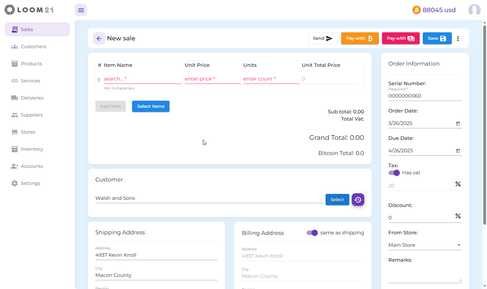

# Documentation Overview

## Sales
- **Add/Edit Sales** 

You can create a new Sale by pressing the button "New Order" 
or edit existing one by clicking on the purple arrow.

  - On the right side of the page, you can enter your order information, and optionally select the store from which you are dispatching (not applicable for services). This selection will be factored into your inventory calculations.
   
  - You can add products or services individually, or search and multi-select by clicking on "Select Items."
  - When selecting a customer, their address will automatically populate, but you can modify it if necessary.
- **Payments**

  - Once your order is saved, payment and share buttons will appear, allowing you to either complete the payment directly or generate and send payment links to your customer.
  - Payments can be made using fiat currency or Bitcoin.
  - You can also generate and share or print documents such as quotes, invoices, receipts, or pickup lists.
  > All features within the application are protected by authentication, except for the links generated through the share button.

## Settings
- **General settings**  

- On this page, you can update your default store, language, currency, VAT settings, toggle Bitcoin prices on or off, and switch between light and dark mode.
- You can also set your address, which will appear on invoices.
  
- **BTCPay Server**  

  To enable Bitcoin payments, you must configure your BTCPay Server URL and API Key.
    
- **Stripe** 

  To accept fiat payments via Stripe, you need to configure your Stripe Publishable and Secret keys.
    
- **Product Categories**

  Organize your products into categories for easier browsing and improved management.
   
 - **Measures**
  
  Define measurement units for your products or services.
  
- **Import Templates**

If you already have a list of products, services, customers, or suppliers, you can import them directly into the system.
  

## Accounts

You can invite an unlimited number of users to your organization as needed.

## Inventory
View and update your product inventory per store.

## Stores
- Add or edit stores.

## Suppliers
- View all your vendors, or add and edit new ones.
## Products
## Services
## Deliveries
## Customers

